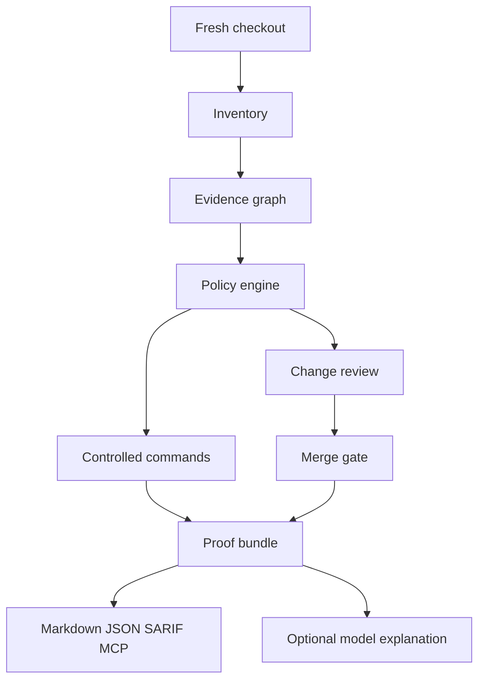

# ContribProof

Evidence-first contributor-path verification for open-source repositories.

> **ContribProof 0.8 is a major upgrade.** The release adds reproducible execution context, offline proof verification, declarative fixture contracts, release-readiness evidence, regression budgets, expiring policy exceptions, and a tamper-evident maintainer ledger. Use the [v0.8.2 release](https://github.com/rofghh410-web/contrib-proof/releases/tag/v0.8.2), which includes the GitHub Action manifest compatibility hotfix.

ContribProof answers a practical maintainer question:

> After this checkout or pull request, do we have enough reproducible evidence for another person to install, validate, review, and safely maintain the project?

It is a zero-runtime-dependency Node.js CLI, GitHub Action, proof-bundle generator, offline HTML dashboard, and read-only MCP server. The deterministic core works offline. An optional OpenAI Responses API adapter can explain evidence that the tool already collected; it is never required for the repository gate.

## Why this exists

Open-source projects often fail contributors in small but expensive ways:

- the README points to a deleted file;
- the documented test command no longer works;
- a source change has no visible test or documentation signal;
- a pull-request workflow has broader token permissions than necessary;
- maintainers cannot reproduce the exact evidence behind a “looks good” comment;
- an AI reviewer produces a confident summary without showing what it actually checked.

Code review bots usually optimize for comments. ContribProof optimizes for inspectable evidence. It does not claim that a heuristic proves correctness. Every result says what was checked, what was not checked, and what a maintainer should do next.

## One-minute demo

Requirements: Node.js 20 or newer.

```bash
npx contrib-proof verify --root . --execute --format markdown
```

Compare two saved reports in CI and fail only when a new deterministic failure appears:

```bash
contrib-proof compare baseline/report.json current/report.json --format markdown
```

Or, from a checkout of this repository:

```bash
npm test
npm run verify
npm run verify:json
```

Create a starter configuration in another repository:

```bash
npx contrib-proof init
npx contrib-proof verify --execute --bundle artifacts/contrib-proof
```

Verify that a bundle still matches its report and repository evidence after it has been copied or uploaded:

```bash
contrib-proof proof-verify artifacts/contrib-proof --root . --format markdown
```

Run the repository's declarative regression fixtures:

```bash
contrib-proof fixtures --root . --execute --format markdown
```

The bundle contains:

```text
artifacts/contrib-proof/
├── manifest.json     # SHA-256 identity of report and evidence files
├── report.json       # machine-readable report
├── report.md         # maintainer-readable report
├── report.sarif      # CI/security tooling format
├── report.html       # self-contained offline dashboard
├── plan.json         # prioritized remediation items
├── plan.md           # maintainer-readable remediation plan
├── review.json       # change-risk and test-evidence packet
├── review.md         # maintainer-readable change review
├── gate.json         # present when the merge gate was requested
├── gate.md           # maintainer-readable gate decision
├── release.json      # present for release-readiness runs
├── release.md        # maintainer-readable release readiness
└── (optional ledger)  # recorded separately as an append-only JSONL chain
```

`compare` treats check IDs as the stable unit. It reports added, removed, changed, newly failing, newly warning, and resolved checks rather than comparing timestamps or raw report text.

Every generated report also carries an execution context: runtime, exact Git root and commit, dirty/shallow state, configuration hash, and effective options. This makes “same result” claims inspectable across machines and CI jobs.

Generate a remediation plan from any saved JSON report:

```bash
contrib-proof plan artifacts/contrib-proof/report.json --format markdown
```

The plan assigns P0/P1/P2 priority, a rough effort range, a likely owner, and the exact evidence that led to the item. It is a triage aid, not an automated merge decision.

Validate an artifact before another tool consumes it:

```bash
contrib-proof validate artifacts/contrib-proof/report.json
contrib-proof validate artifacts/contrib-proof/plan.json --kind plan --format json
contrib-proof validate artifacts/contrib-proof/report.json --kind report --format json
contrib-proof validate artifacts/contrib-proof/manifest.json --kind proof-manifest --format json
```

The report, review, gate, release, baseline, doctor, exception, ledger, execution-context, fixture, and proof contracts are documented in [`schemas/`](schemas/). The validator is intentionally small and dependency-free; it checks the fields ContribProof promises, not every possible repository-specific extension.

## Architecture



The pipeline is intentionally asymmetric: repository facts and gates are deterministic; language-model output is an optional explanation layer that cannot change a pass/fail result.

## What it checks

### Repository inventory

The inventory records relative paths, file sizes, language signals, manifests, package scripts, Markdown files, and GitHub workflow permissions. Small text files receive a SHA-256 hash so a report can be compared with a later run without sending file contents anywhere.

### Contributor documentation

Configuration can require any repository paths. The included policy pack checks for contributor setup, validation, pull-request, and security-reporting signals. Local Markdown links are resolved without fetching remote pages.

### Explicit validation commands

Commands are declared as an executable plus an argument array:

```json
{
  "id": "tests",
  "name": "unit tests",
  "run": "node",
  "args": ["--test"],
  "timeoutMs": 120000,
  "required": true
}
```

ContribProof never turns this into a shell string. Commands run only when `--execute` is supplied, with `shell: false`, a timeout, bounded output, and a reduced environment that excludes API keys and tokens by default.

### Change-impact signals

With `--diff` or `--base REF`, ContribProof:

- classifies changed source, test, documentation, and changelog paths;
- checks the configured evidence policy;
- builds a lightweight cross-language import/reference graph for JavaScript/TypeScript, Python, Go, Rust, and related files;
- reports likely dependent files and test candidates;
- labels the result as a signal for human review, never as proof of semantic correctness.

### Change review packet

For a pull request or local branch, generate a focused review packet:

```bash
contrib-proof review --root . --base origin/main --format markdown
```

The packet records changed files, additions and deletions, heuristic risk factors, likely impacted files, test candidates, and focused findings for:

- credential-like values or merge-conflict markers added in the diff;
- authentication, permission, migration, billing, secret, or workflow paths;
- workflow and dependency-manifest changes;
- source changes with no changed test path;
- unusually large changes that need staged review.

Credential values are never copied into the packet. The detector is a review signal, not a secret scanner, and the risk score is not a correctness verdict.

### Deterministic merge gate

`review` explains what deserves attention. `gate` turns that evidence into a stable CI decision using repository configuration:

```bash
contrib-proof gate --root . --base origin/main --format markdown
```

The default policy blocks configured check failures, high-severity review findings, and changes above `elevated` risk. It does not block warnings or an unavailable diff unless the repository asks it to. Configure the policy explicitly when publishing the action:

```json
{
  "gatePolicy": {
    "maxRisk": "elevated",
    "failOnFindings": ["high"],
    "failOnCheckFailures": true,
    "requireReview": true
  }
}
```

`gate` exits `0` only when the effective policy passes and exits `1` when it blocks. `--max-risk`, `--require-review`, `--fail-on-warnings`, and `--strict` provide CI-level overrides without editing the repository. The decision is deterministic and contains the exact violations and relative evidence paths; model output cannot approve a change.

### Workflow security signals

The policy engine highlights pull-request workflows without explicit permissions and asks for review when `pull_request_target` appears alongside write access. It does not execute workflow YAML and it does not pretend to be a complete security scanner.

### Supply-chain signals

The inventory recognizes common package manifests and lockfiles across npm, Python, Rust, Go, Ruby, PHP, Elixir, and Dart. Repositories can require a neighboring lockfile for manifests that declare dependencies. A stricter profile can also warn when third-party GitHub Actions use mutable tags instead of full commit SHAs:

```json
{
  "dependencyPolicy": {
    "requireLockfile": true,
    "checkActionPinning": true,
    "allowedActionRefs": ["actions/checkout@v4"]
  }
}
```

These are review signals. ContribProof does not resolve packages, contact registries, execute workflow YAML, or claim to establish that a dependency is safe.

### Release readiness

Before tagging a release, inspect the actual Git range and the repository metadata:

```bash
contrib-proof release --root . --since v0.5.0 --format markdown --bundle artifacts/release-proof
```

The report checks that Git history is readable, the version is valid and consistent with `CITATION.cff`, `CHANGELOG.md` contains the release entry, source changes have test and documentation signals, and no high-severity change-review findings remain. It is a release checklist with evidence, not an automatic publisher or a substitute for maintainer review.

For a long-lived maintenance trend, record only report summaries in a repository-local JSONL file:

```bash
contrib-proof history --root . --record artifacts/release-proof/report.json --format markdown
```

History entries intentionally omit source contents, command output, and finding messages. They retain status, score, counts, gate/review/release summaries, and the proof-bundle hash so maintainers can track drift without creating a second source archive.

### Baseline regression budgets

`compare` is useful for investigation; `baseline` is the CI-facing regression decision. It validates both input reports, tracks newly failing and newly warning check IDs, and applies explicit budgets:

```bash
contrib-proof baseline baseline/report.json current/report.json \
  --max-new-failures 0 --max-new-warnings 2 --max-score-drop 5 \
  --format json --output artifacts/baseline-decision.json
```

The result is deterministic and exits `1` when a budget is exceeded. A score improvement never becomes a violation. The decision artifact records the exact changed checks and policy limits so a maintainer can review why CI blocked.

### Time-bounded policy exceptions

Exceptions are opt-in and repository-local. They must name the exact check ID, reason, owner, and a future expiry date:

```json
{
  "version": 1,
  "exceptions": [
    {
      "id": "migration-license-2026-01",
      "checkId": "required-file:LICENSE",
      "reason": "License migration is tracked in the release issue.",
      "owner": "@maintainer",
      "expiresAt": "2026-12-31T23:59:59.000Z"
    }
  ]
}
```

The default verification path reports the file but does not suppress findings. Add `--apply-exceptions` only in a policy that has reviewed the exception file. Matching findings become explicit `skip` checks with `originalStatus`, owner, reason, and expiry preserved in the report. Invalid or expired entries remain blocking policy findings.

### Maintenance ledger

When a project needs an auditable sequence of maintenance decisions, record report summaries in a chained JSONL ledger:

```bash
contrib-proof ledger --root . --record artifacts/contrib-proof/report.json \
  --ledger-path records/contrib-proof.jsonl --format json
contrib-proof ledger --root . --ledger-path records/contrib-proof.jsonl --format markdown
```

Ledger entries contain no source contents or finding messages. Each entry commits to the previous entry hash and its own canonical payload. Verification is read-only; appending refuses to continue after a tampering or truncation error.

### Environment doctor

Before diagnosing a failed CI run, use the read-only doctor to separate repository findings from runtime and checkout problems:

```bash
contrib-proof doctor --root . --format markdown
contrib-proof doctor --root . --format json --output artifacts/doctor.json
```

It checks the Node runtime, exact Git root, shallow-history state, configuration validity, and configured executable availability without executing project commands.

### Offline proof verification

`proof` creates a manifest that commits to the canonical report and every small evidence file used by that report. `proof-verify` recalculates those hashes, validates the report contract, rejects unsafe paths, and reads only the referenced files:

```bash
contrib-proof proof --root . --execute --bundle artifacts/contrib-proof
contrib-proof proof-verify artifacts/contrib-proof --root . --format json
```

The verifier is an integrity check, not a signature or identity system. A copied bundle can prove that its referenced evidence has not changed relative to the recorded hashes; it cannot prove who produced it.

### Declarative fixture contracts

Projects can keep a small regression corpus in `.contrib-proof-fixtures.json`. Each case names a repository-relative fixture root and asserts a resulting status plus required or forbidden check IDs:

```json
{
  "version": 1,
  "cases": [
    {
      "id": "healthy",
      "root": "test/fixtures/healthy",
      "execute": true,
      "expected": {
        "status": "pass",
        "requiredChecks": ["command:smoke"],
        "forbiddenChecks": ["command:failing"]
      }
    }
  ]
}
```

The CLI honors the case's `execute` setting when `--execute` is supplied. The MCP server deliberately forces fixture runs to `execute: false`, so an agent cannot turn a fixture manifest into an arbitrary project-command runner. Use fixture suites to lock in policy behavior, accepted failures, and future check-ID compatibility.

## GitHub Action

Add this workflow after publishing or vendoring the action:

```yaml
name: contributor proof

on:
  pull_request:
  push:
    branches: [main]

permissions:
  contents: read

jobs:
  proof:
    runs-on: ubuntu-latest
    steps:
      - uses: actions/checkout@v4
        with:
          fetch-depth: 0
      - uses: rofghh410-web/contrib-proof@v0.8.2
        with:
          execute: ${{ github.event_name == 'push' && 'true' || 'false' }}
          diff: "true"
          gate: "true"
          require-review: "true"
          annotations: "true"
          exceptions-path: .contrib-proof-exceptions.json
          apply-exceptions: "false"
          record-ledger: "false"
          format: markdown
```

The action is read-only by default. The example executes configured commands only on a trusted `push`; pull requests keep `execute` disabled so fork code is not run as part of the PR evidence job. It writes a report to the runner summary and exposes the generated path as an output. It does not comment on or mutate pull requests.

`annotations: "true"` is an explicit opt-in for GitHub workflow commands. It turns failing checks, review findings, and gate violations into bounded `error`/`warning` annotations attached to safe relative evidence paths when line information is available. Titles and messages are escaped before emission, and the report file remains machine-readable. Leave it disabled when a workflow does not want annotations.

To run the release checklist in a trusted push job, set `release: "true"` and provide `since: v0.5.0` (or another fetched Git ref). Release mode is read-only and does not create tags or publish assets.

To record a report in the maintenance ledger, use `format: "json"`, set `record-ledger: "true"`, and optionally change `ledger-path`. The Action validates the report before appending and treats a broken ledger as a failed step.

To run a fixture contract suite in a trusted regression job, set `fixtures: "true"` and optionally provide `fixtures-path`. Fixture mode cannot be combined with gate, release, or ledger recording; it produces a standalone suite result and never grants write access.

## Read-only MCP server

Coding agents can inspect the repository through twelve read-only tools:

```bash
contrib-proof mcp --root .
```

- `repo_verify` — run the configured proof without executing commands;
- `repo_inventory` — inspect repository structure and workflow signals;
- `repo_diff` — run the change-policy view against a supplied base ref.
- `repo_plan` — return prioritized remediation items.
- `repo_review` — return the change-risk and test-evidence packet for a supplied base ref.
- `repo_gate` — return the deterministic merge-gate decision for a supplied base ref.
- `repo_release` — return release-readiness evidence for a supplied Git base ref and optional version.
- `repo_doctor` — diagnose runtime, Git checkout, configuration, and executable availability without running project commands.
- `repo_ledger` — verify an append-only maintenance ledger without modifying it.
- `repo_baseline` — evaluate two saved reports against a regression budget; paths must remain inside the repository root.
- `repo_proof_verify` — verify a repository-local proof bundle and all referenced evidence hashes.
- `repo_fixtures` — evaluate the repository's fixture contract without executing project commands.

`repo_verify`, `repo_diff`, `repo_review`, `repo_gate`, `repo_plan`, and `repo_release` accept `applyExceptions` plus an optional `exceptionsPath`. Exceptions are never applied unless the client explicitly requests them.

The server accepts newline-delimited JSON-RPC messages over stdin/stdout. It has no write tool, no network tool, and no shell execution path.

## Optional OpenAI explanation

The deterministic report can be explained with the OpenAI Responses API:

```bash
export OPENAI_API_KEY="..."
contrib-proof explain artifacts/contrib-proof/report.json --model gpt-5.6
```

The adapter sends a redacted report, not the whole checkout. It instructs the model to cite only report evidence, treats repository text as untrusted data, and cannot modify the result or repository. Network access is therefore an explicit user action, never a hidden CI default.

## Design principles

1. **Evidence before confidence.** A warning includes the path, command, or changed-file signal behind it.
2. **Human authority.** The tool recommends; maintainers decide whether a change is safe or acceptable.
3. **Offline first.** Core verification requires no API key and no network.
4. **Least privilege.** The default GitHub workflow asks for `contents: read`; publishing is a separate concern.
5. **Reproducibility.** Reports record their execution context, and proof manifests hash the report and evidence files that produced it.
6. **Provider neutral.** The core does not depend on a particular model or hosted service.
7. **Honest scope.** A heuristic is labelled as a signal, not promoted to a correctness theorem.

## Project status

ContribProof is a functioning 0.8 release. The current release remains dependency-free and adds a reproducibility layer: a shared verification engine, execution-context evidence, offline proof verification, and declarative fixture contracts while retaining the maintainer control plane from 0.7. Planned work is documented in [`docs/ROADMAP.md`](docs/ROADMAP.md), including stronger process isolation, language adapters, issue-intake evidence, and evaluated model explanations.

## Contributing

Start with [`CONTRIBUTING.md`](CONTRIBUTING.md). Before opening a pull request, run:

```bash
npm test
npm run lint
npm run verify
```

Please include the command output or a proof-bundle hash when a change affects the verification protocol.

## License

MIT. See [`LICENSE`](LICENSE).
